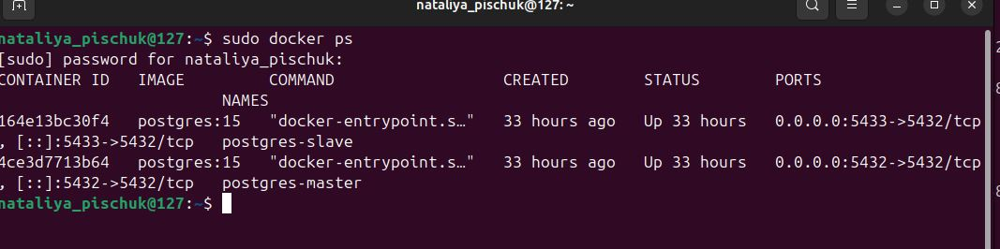
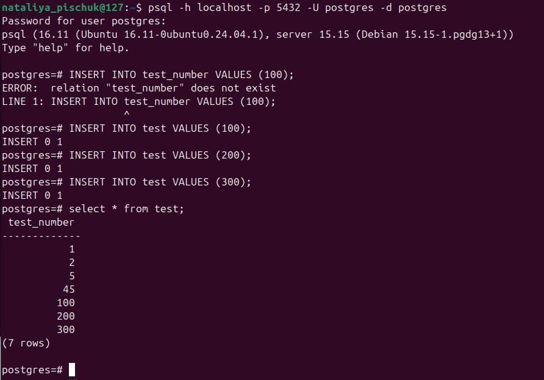
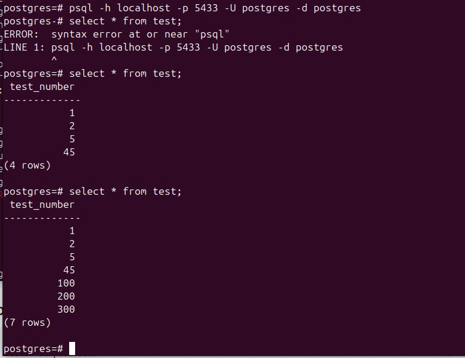
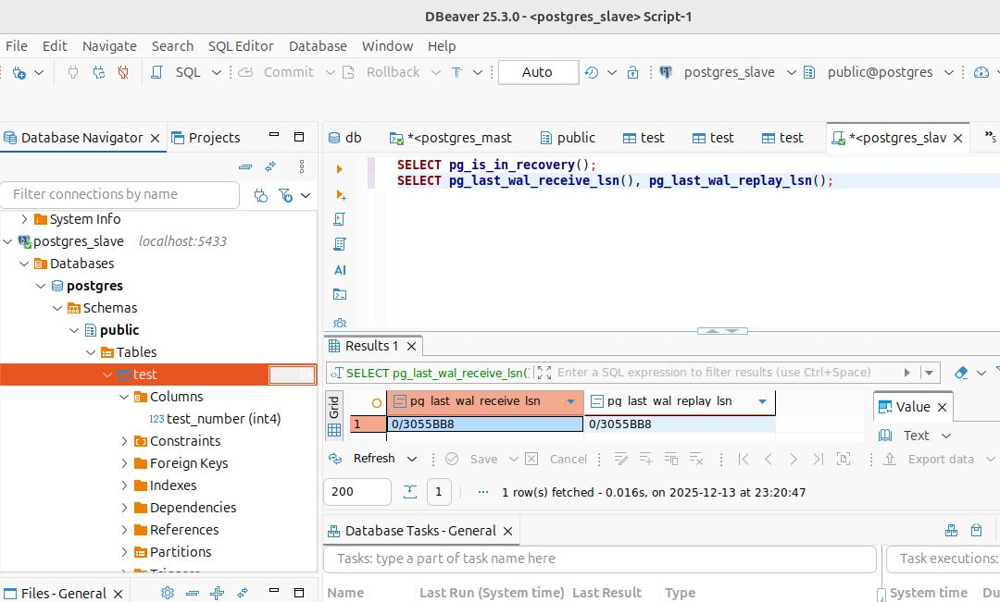

# Домашнее задание к занятию «Репликация и масштабирование. Часть 1»
## Инструкция по выполнению домашнего задания
1. Сделайте fork репозитория c шаблоном решения к себе в Github и переименуйте его по названию или номеру занятия, например, https://github.com/имя-вашего-репозитория/gitlab-hw или https://github.com/имя-вашего-репозитория/8-03-hw).
2. Выполните клонирование этого репозитория к себе на ПК с помощью команды git clone.
3. Выполните домашнее задание и заполните у себя локально этот файл README.md:
- впишите вверху название занятия и ваши фамилию и имя;
- в каждом задании добавьте решение в требуемом виде: текст/код/скриншоты/ссылка;
- для корректного добавления скриншотов воспользуйтесь инструкцией «Как вставить скриншот в шаблон с решением»;
- при оформлении используйте возможности языка разметки md. Коротко об этом можно посмотреть в инструкции по MarkDown.
4. После завершения работы над домашним заданием сделайте коммит (git commit -m "comment") и отправьте его на Github (git push origin).
5. Для проверки домашнего задания преподавателем в личном кабинете прикрепите и отправьте ссылку на решение в виде md-файла в вашем Github.
6. Любые вопросы задавайте в разделе «Вопросы по заданию» в личном кабинете.
Желаем успехов в выполнении домашнего задания.

## Задание 1
На лекции рассматривались режимы репликации master-slave, master-master, опишите их различия.

Ответить в свободной форме.
##  Ответ
В режиме репликации master-slave: данные передаются односторонне — от сервера master к серверам slave. Только master может записывать данные, slave — только чтение. Согласованность данных происходит асинхронно, поэтому возможны задержки в согласованности данных.

В режиме репликации master-master все мастера могут как писать, так и читать данные. Согласованность данных может быть синхронной поэтому может выполняется немедленно. Каждый из серверов выступает одновременно в качестве мастера и в качестве слэйва. В этом случае может возникнуть проблема с разрешением конфликтов, когда, например, два запроса начинают одновременно менять одну и те же данные.

## Задание 2
Выполните конфигурацию master-slave репликации, примером можно пользоваться из лекции.
Приложите скриншоты конфигурации, выполнения работы: состояния и режимы работы серверов.

## Решение 
Взяла пример из лекции. Развернула через docker-compose master и slave бд Postgress

1. Запускаем контейнеры и проверяем их состояние
```

    docker-compose up -d
    docker-compose ps
```



2. Подключаюсь к БД master
 psql -h localhost -p 5432 -U postgres -d postgres;

Master сервер:
```
    Хост: localhost
    Порт: 5432
    Пользователь: postgres
    Пароль: postgres
```


3. Подключаюсь к БД slave
psql -h localhost -p 5433 -U postgres -d postgres;

Slave сервер:

    Хост: localhost
    Порт: 5433
    Пользователь: postgres
    Пароль: postgres
    


4. Проводим тестирование, данные добавляю как из консоли, так и добавляю через DBeaver

Дополнительно проверяю статус репликации




